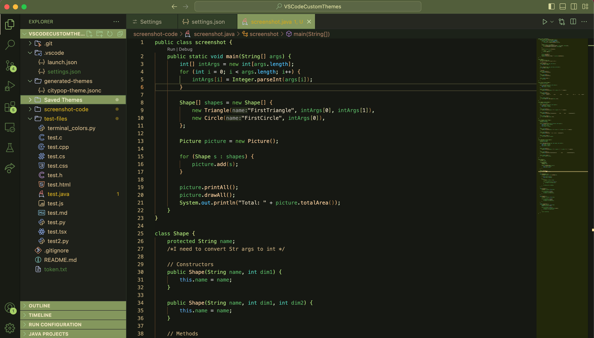
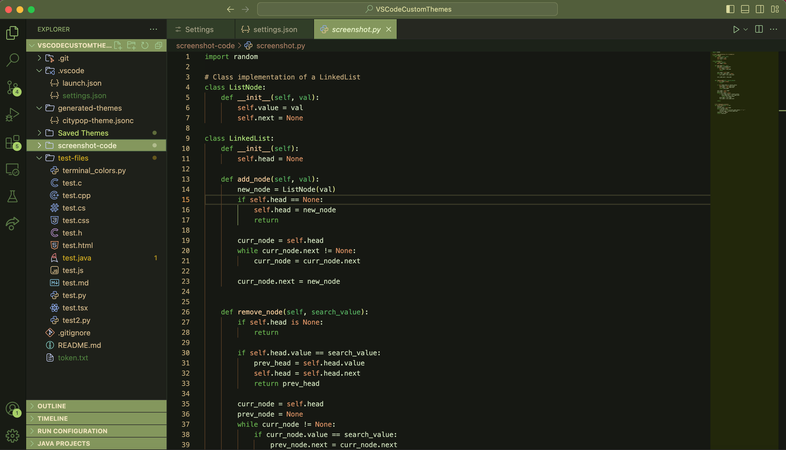
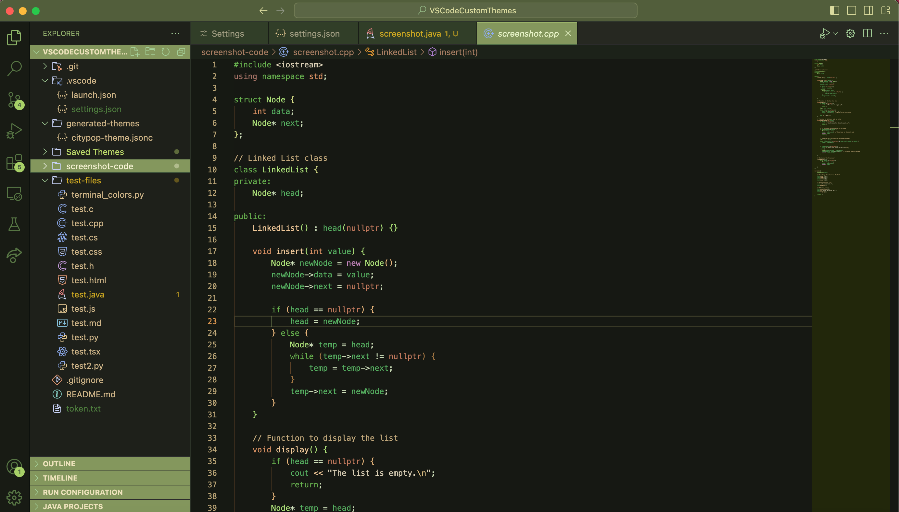
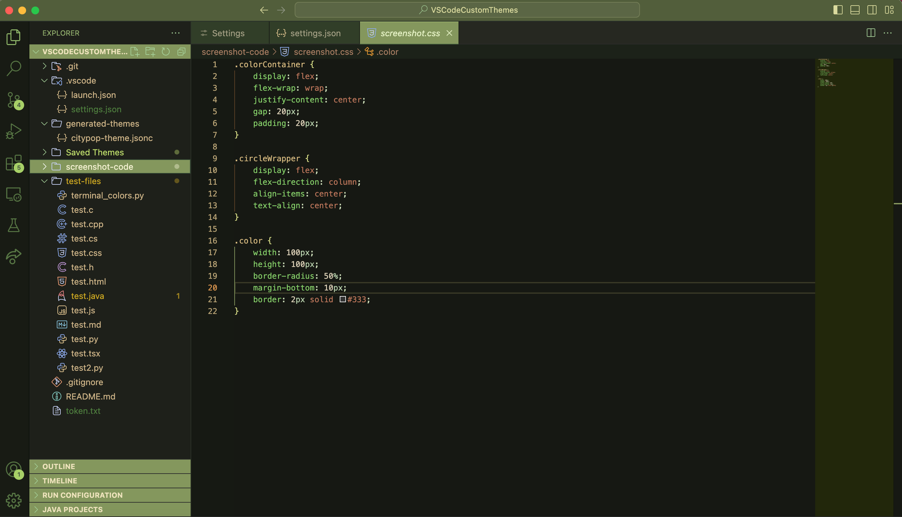

## About
A dark theme with warm and cool greens, meant for someone who loves green! ヽ(・ω・)ﾉ

## Previews
### Java

### Python

### C++

### CSS

## Other Customizations
If you want to add some custom fonts, here are some recommendations for some basic fonts (there are a lot more free ones you can try out!):

### Fonts
The one I'm currently using: [Monaspace](https://monaspace.githubnext.com/)

Another one I like: [Victor Mono](https://github.com/rubjo/victor-mono)

Many people like this one: [FiraCode](https://github.com/tonsky/FiraCode?tab=readme-ov-file)

Used in Visual Studio: [Cascadia Code](https://github.com/microsoft/cascadia-code)